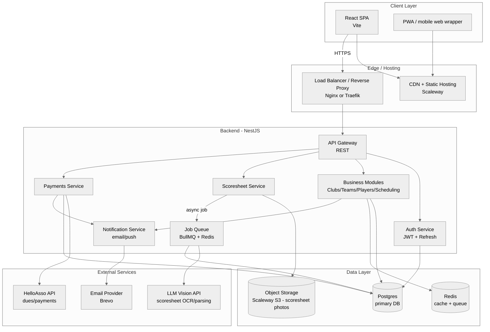
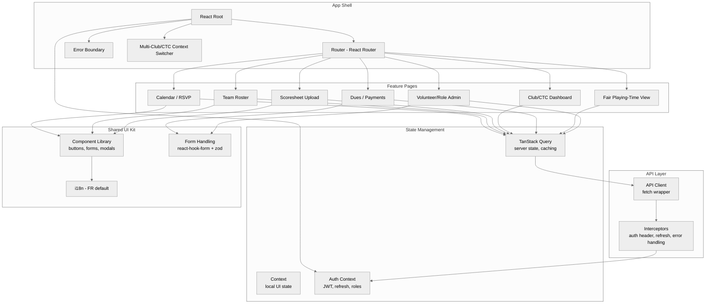
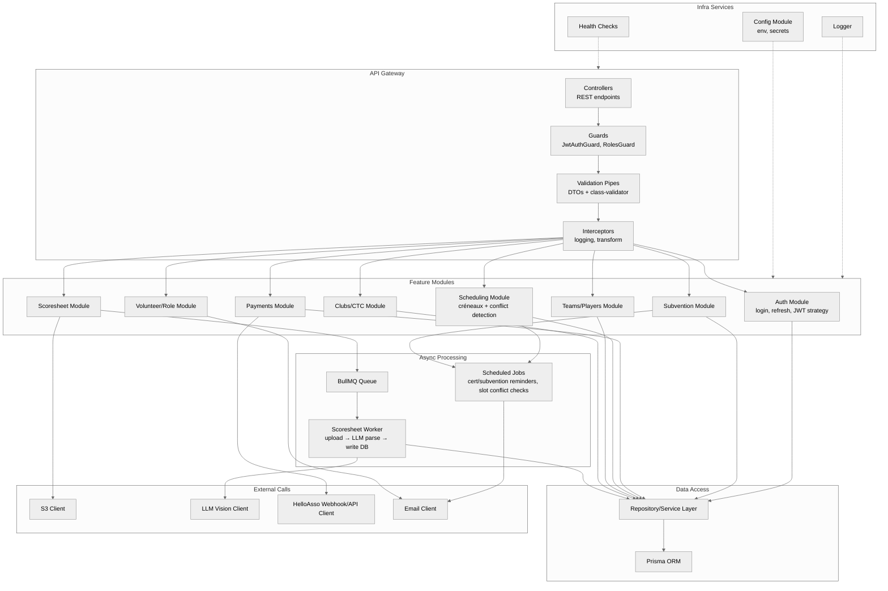
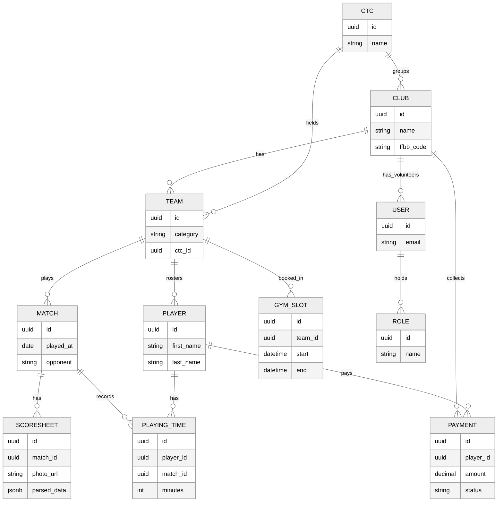

# BasketEasy — Architecture

## Global (detailed)

---

## Frontend (detailed)

---

## Backend (detailed)

---

## DB (entity overview)

---

## Repo ↔ architecture mapping

This monorepo currently scaffolds the **Client Layer** (`apps/web`) and the **API Gateway + Health** slice of the **Backend Layer** (`apps/api`). The domain modules (Auth, Clubs/Teams, Scheduling, Scoresheet, Payments, Subvention, Volunteer/Role), the BullMQ queue, and the external integrations (LLM vision, HelloAsso, Brevo) are not implemented yet — see `CLAUDE.md` and the feature list in `docs/feature-set.md` for what's next.
